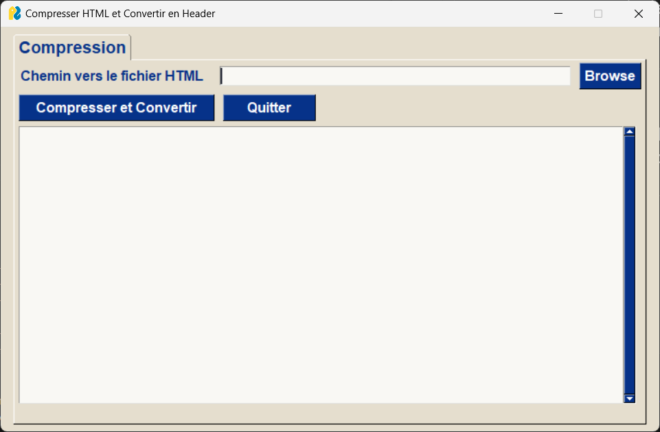
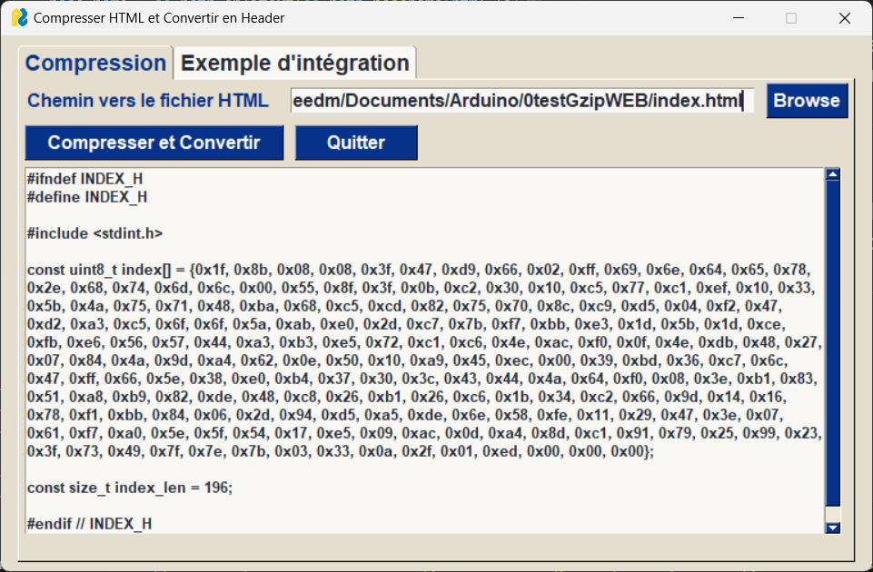
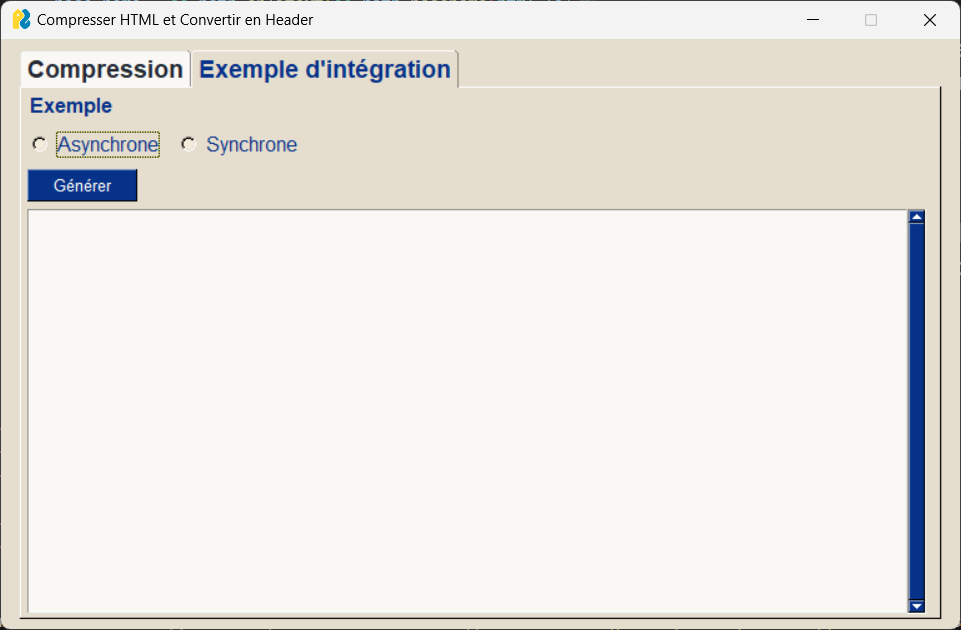
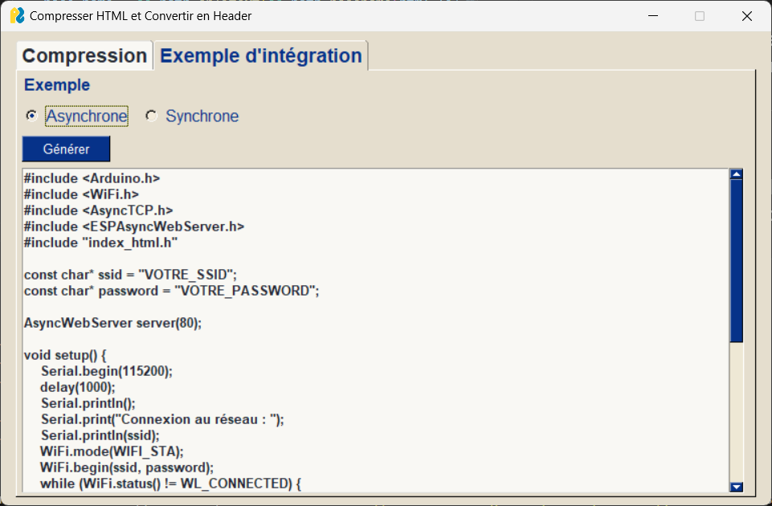
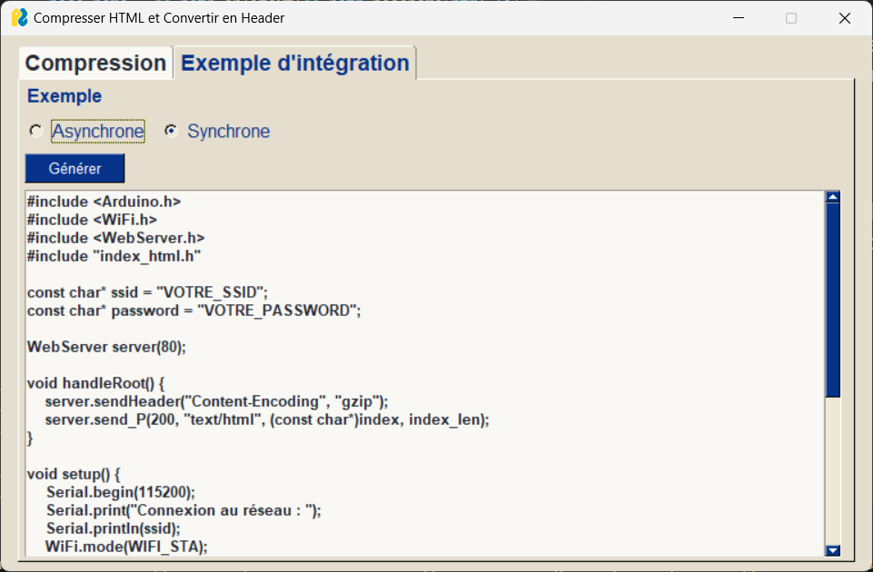

# GzipForWebESP32
 gzip compression et céation d'un header pour la page html

## Rechercher un fichier HTML, le compresser en GZIP et le mettre sous forme de tableau de uint8_t dans un fichier .h

 

## Proposer un exemple d'intégration de ce header pour un ESP32 en fonction du type de serveur synchrone ou asynchrone.

 
